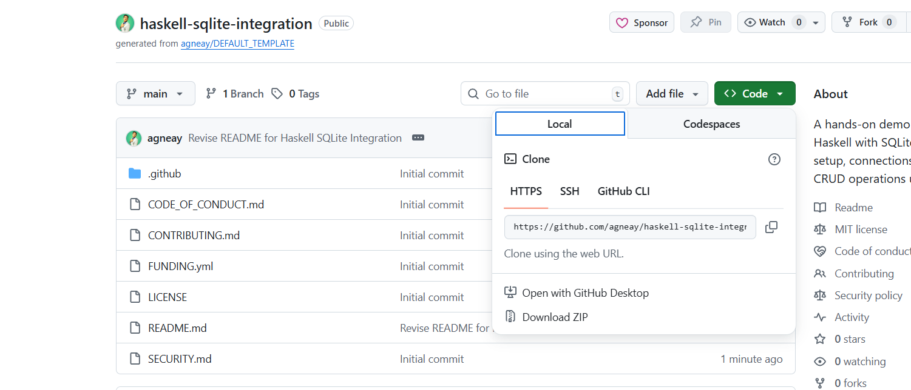

# Haskell sqlite Integration  [](https://forthebadge.com) 
A hands-on demonstration of integrating Haskell with SQLite, covering database setup, connections, queries, and basic CRUD operations using Haskell libraries


## Step 1: Setting Up codespaces
To set up a GitHub Codespace for this project, follow these steps:
1. **Navigate to the Repository**: Go to the GitHub repository for this project.
2. **Open Codespaces**: Click on the green "Code" button, then select "Open with Codespaces" and choose "New codespace".


3. **Configure Codespace**: Once the Codespace is created, it will automatically set up the development environment based on the configuration files in the repository (like `.devcontainer`).
4. **Start Coding**: After the environment is ready, you can start coding and working on the project directly in the browser.

## Step 2: Installing Dependencies
Open the terminal inside Codespaces and run:
```bash
sudo apt update
sudo apt install -y ghc cabal-install sqlite3 libsqlite3-dev
```

What this installs

- `ghc` → Haskell compiler

- `cabal` → Haskell package/build tool

- `sqlite3` → SQLite CLI (useful for debugging)

- `libsqlite3-dev` → Native SQLite headers (required for Haskell bindings)

## Step 3: Verify Installation
run the following commands to verify that everything is installed correctly:
```bash
ghc --version
cabal --version
sqlite3 --version
```

## Step 4: Initialize a Haskell project
Create a Cabal project:
```bash
cabal init
```

When prompted:

- What does the package build ? `Executable`
- Do you wish to overwrite existing files (backups will be created) (y/n)? [default: n] `y`
- Please choose version of the Cabal specification to use: `3.0`
- package-name: `default`
- package-version: `default`
- license: `MIT`
- Author: `Your Name`
- email: `Your email`
- Project homepage url: `skip`
- project synopsis: `skip`
- project category: `Database`
- what is the main module: `Main.hs`
- Application directory: `app`
- Language: `Haskell2010`
- add comments: `y`

Use defaults for the rest

This creates:
```
.
├── app/Main.hs
├── haskell-sqlite-demo.cabal
└── cabal.project
```

## Step 5: Add SQLite dependency
Edit `haskell-sqlite-demo.cabal` and add `sqlite-simple` to the dependencies:
```cabal
executable haskell-sqlite-demo
  main-is:          Main.hs
  build-depends:    base ^>=4.17.0.0,
                    sqlite-simple
  hs-source-dirs:   app
  default-language: Haskell2010
```

## Step 7: Build and run the project
run the following commands in the terminal:
```bash
cabal update
cabal build
cabal run
``` 

if you see output like this, it means everything is working correctly:
```batch
Up to date
Hello, Haskell!
```
else check for any error messages and ensure that all dependencies are installed correctly.

## Step 8: Write your first SQLite-backed Haskell program
Open app/Main.hs and replace everything with:
```haskell
{-# LANGUAGE OverloadedStrings #-}

import Database.SQLite.Simple

main :: IO ()
main = do
    conn <- open "test.db"

    execute_ conn
        "CREATE TABLE IF NOT EXISTS users (id INTEGER PRIMARY KEY, name TEXT)"

    execute conn
        "INSERT INTO users (name) VALUES (?)"
        (Only ("Agneay" :: String))

    rows <- query_ conn
        "SELECT id, name FROM users" :: IO [(Int, String)]

    mapM_ print rows

    close conn
```

rebuild and run the project again:
```bash
(1,"Agneay")
``` 
If you see the output above, it means your Haskell program successfully created a SQLite database, inserted a record, and queried it back.

## Line-by-Line Explanation

### 1. Language Extension
```haskell
{-# LANGUAGE OverloadedStrings #-}
```
Allows string literals to automatically adapt to types like `Text` or
`ByteString`, which SQLite libraries expect.

---

### 2. Module Declaration
```haskell
module Main where
```
Defines the entry module. Every Haskell executable must have a `Main` module
with a `main` function.

---

### 3. Import SQLite Library
```haskell
import Database.SQLite.Simple
```
Imports functions for:
- Opening / closing connections
- Executing SQL commands
- Querying rows safely

---

### 4. Main Function
```haskell
main :: IO ()
```
Indicates the program performs **IO operations** such as file and database
access.

---

### 5. Opening the Database
```haskell
conn <- open "test.db"
```
- Opens (or creates) `test.db`
- Returns a `Connection`
- `<-` extracts a value from an `IO` action

---

### 6. Creating a Table
```haskell
execute_ conn
  "CREATE TABLE IF NOT EXISTS users (id INTEGER PRIMARY KEY, name TEXT)"
```
- `execute_` is used for SQL statements **without parameters**
- Safe to run multiple times due to `IF NOT EXISTS`

---

### 7. Inserting Data (Prepared Statement)
```haskell
execute conn
  "INSERT INTO users (name) VALUES (?)"
  (Only ("Agneay" :: String))
```
- `?` is a placeholder
- `Only` wraps a single value
- Prevents SQL injection
- Ensures type safety

---

### 8. Querying Data
```haskell
rows <- query_ conn
  "SELECT id, name FROM users" :: IO [(Int, String)]
```
- `query_` is used when no parameters are needed
- Each row is mapped to a Haskell tuple `(Int, String)`
- Type annotation tells Haskell how to decode rows

---

### 9. Printing Results
```haskell
mapM_ print rows
```
- Prints each row
- `_` means the result is ignored

---

### 10. Closing the Connection
```haskell
close conn
```
Releases the database file safely and prevents corruption.


[](https://ko-fi.com/Y8Y21JGEH6)
